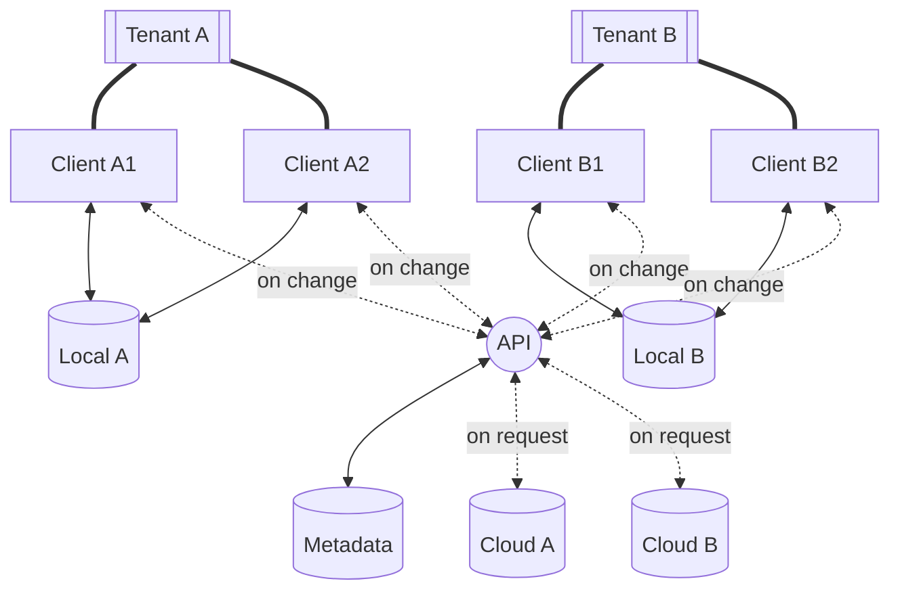

# Database Sync (db-sync)

POC: This multi-tenant solution should be able to sync a local database with its cloud bidirectionally

## Specification

- Create Cloud Database configuration for new users automatically
- Authenticate incoming requests and pick the correct database connection
- Replicate changes between the Cloud DB and the Local DB bidirectionally

### Diagram

