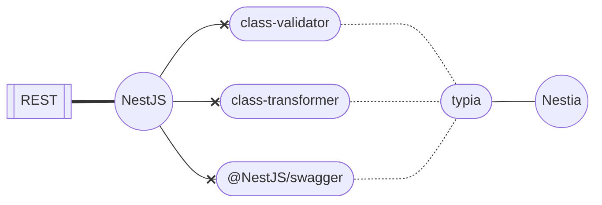

<p align="center">
  <a href="http://nestia.io/" target="blank"></a>
</p>

# RESTIA: `Nestia` + `NestJS` for `REST` APIs



## Context

NestJS is excellent. It has been my favorite backend framework since 2020. However, its own way of doing things sometimes causes a lot of repetition.

For example, its reliance on classes makes its code tightly-coupled to other components within the project, and using simple TypeScript features like defining types and being able to use the same definition on another application becomes harder because of this reason.

This becomes even more complex when it comes to getting Swagger UI to show up on REST APIs built using tools in the NestJS eco-system. The number of classes to create, and the number of decorators to add in order to build the `swagger.json` is insane.

This is when I came across [Nestia](https://nestia.io) by [Jeongho Nam](https://github.com/samchon), who also created [Typia](https://typia.io). It supports **Runtime Validation**, **JSON Parsing**, and **JSON Schema Validation**. It's good... It's straight-forward! No need to create dozens of classes, which can't even be re-used with other projects anymore. TypeScript types and interfaces can do the job.

### Limitations

**1. Schema generation isn't perfect when using TypeScript Generics.**

```ts
export type HttpResponse<T> = {
  data?: T;
  errors?: unknown;
};

export type TextResponse = HttpResponse<string>; // ❌ This doesn't work properly
/**
 * This is a workaround to fix the issue that
 * `nestia` does not generate the right types
 * when we use generic types in the response model.
 * It creates something like `DataResponse_lt_T_gt_`,
 * which is not ideal although it shows the right type
 * when you expand the schema in Swagger UI.
 */
export interface TextResponse extends HttpResponse<string> {} // ✅ This works
```

**2. We have less control over `BadRequestException` thrown by Typia on validation errors**

We can define custom error messages when we use `class-validator`. But when we use Typia, it uses its predefined error messages when a validation error occurs.

These are invoked only when the request body is decorated using `@TypedBody` decorator from `@nestia/core`. I wonder if we can use the traditional `@Body` decorator from `@nestjs/common` along with `class-validator` on the same project to do the validation for a specific set of routes. I should test out its impact on Swagger Doc generation too. Later...

### How to use this repository

1. Clone this or create your repository using this as a template
2. Update `package.json` file -- like, `name`, `version` etc according to your project.
3. If there's `package.lock.json`, delete it -- I might have forgotten to delete it.
4. Run the install command of your favorite package manager -- I ❤️ `pnpm`.

   ```
   pnpm install
   ```

   ```
   npm install
   ```

5. Use the `start:dev` script to run the server in watch mode for development on [`http://localhost:3000`](http://localhost:3000).

   ```
   pnpm start:dev
   ```

   ```
   npm run start:dev
   ```

6. View Swagger Docs at [`http://localhost:3000/api/swagger`](http://localhost:3000/api/swagger). You can change the endpoint in `main.ts`.

### How to create a new set of controllers easily

1. Create a copy of the `src/modules/entities` folder.
2. Update the names of the files and their contents to match the new entity (e.g. `users/`).
   - Make it a plural noun to respect the elders.
     - Ref: [Microsoft REST API Guidelines](https://github.com/microsoft/api-guidelines/blob/vNext/Guidelines.md)
   - So you will have the following:
     - `UsersModule`
     - `UsersController`
     - `UsersService`
3. Import the module into `AppModule` in `src/modules/app/app.module.ts`, just like on NestJS.

   ```ts
   import { Module } from '@nestjs/common';
   import { EntitiesModule } from '../entities/entities.module';
   import { UsersModule } from '../users/users.module';
   import { AppController } from './app.controller';
   import { AppService } from './app.service';

   @Module({
     imports: [EntitiesModule, UsersModule],
     controllers: [AppController],
     providers: [AppService],
   })
   export class AppModule {}
   ```

4. Create the types relevant to the new entity inside `/types` (or anywhere that makes sense -- it doesn't matter as long as there is a type definition somewhere).

   - For example, create `src/types/users.d.ts` that might look something like this.

     ```ts
     import { HttpResponse } from './core';

     export type User = {
       /**
        * @format uuid
        */
       id: string;
       /**
        * @minLength 1
        * @maxLength 100
        */
       name: string;
     };

     export interface OneUserResponse extends HttpResponse<User | undefined> {}

     export interface ManyUsersResponse
       extends HttpResponse<User[] | undefined> {}

     export interface CreateUserRequest extends Omit<User, 'id'> {}

     export interface UpdateUserRequest extends Partial<CreateUserRequest> {}
     ```
